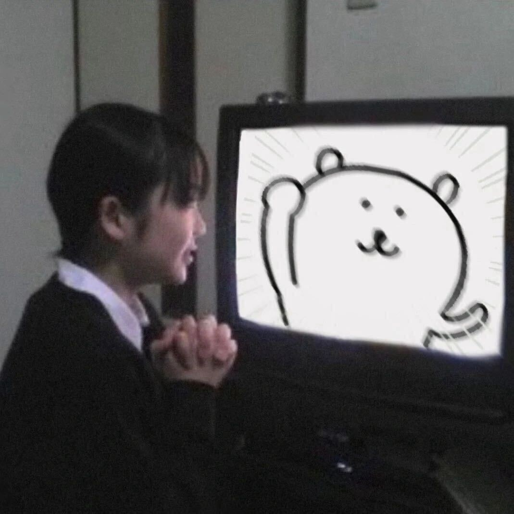
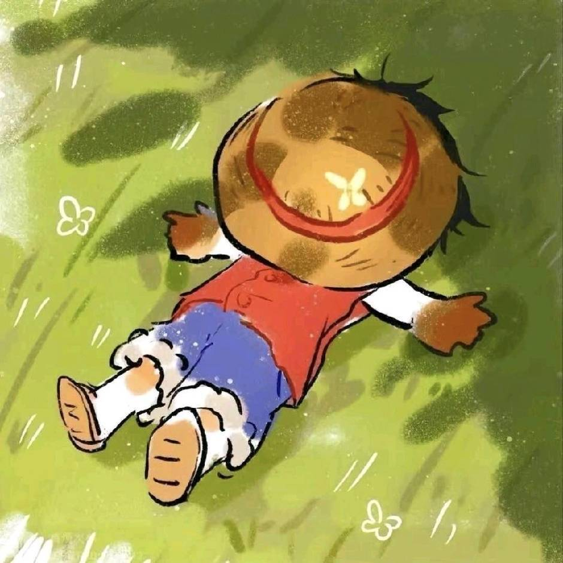
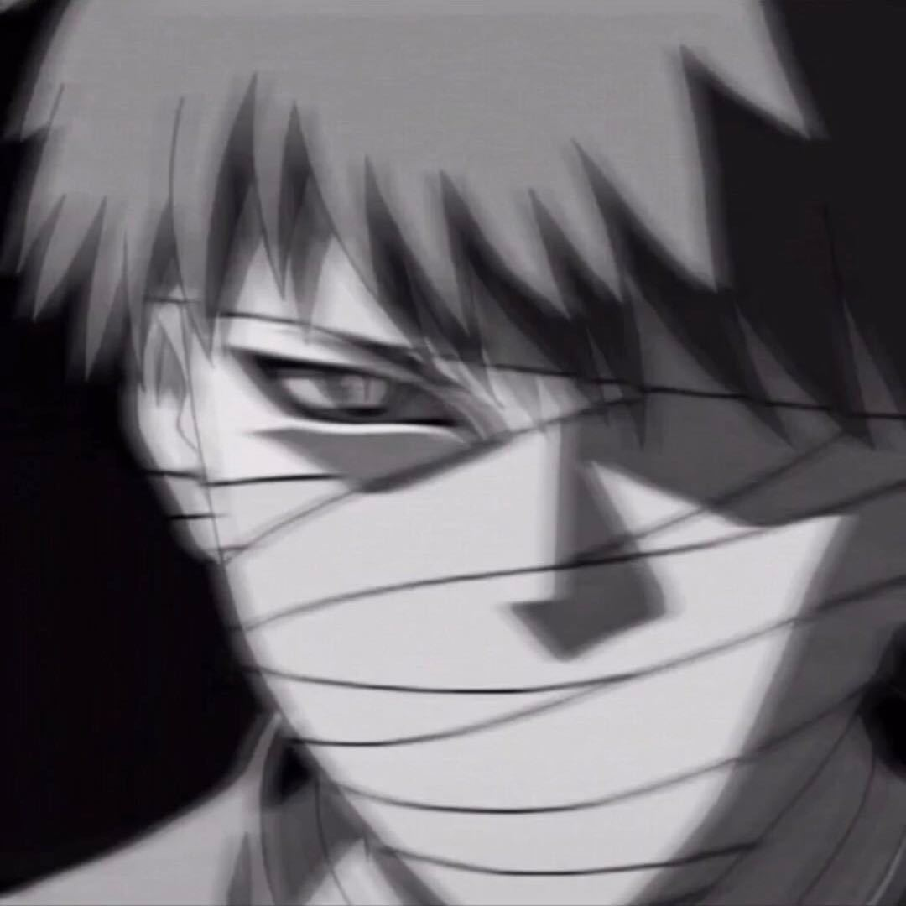
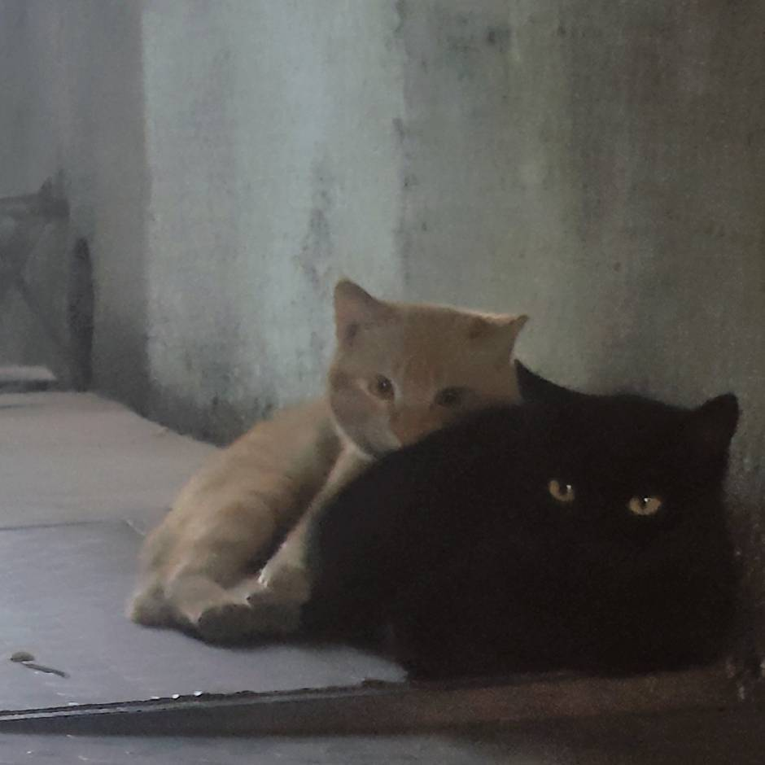
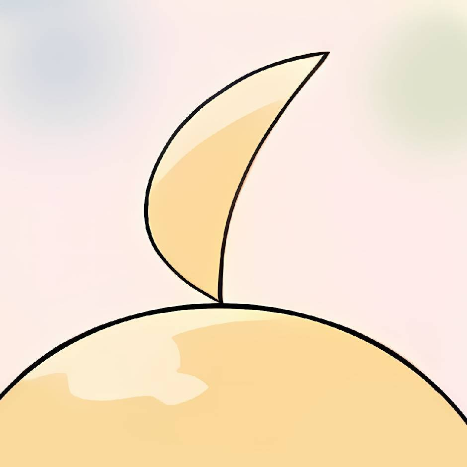
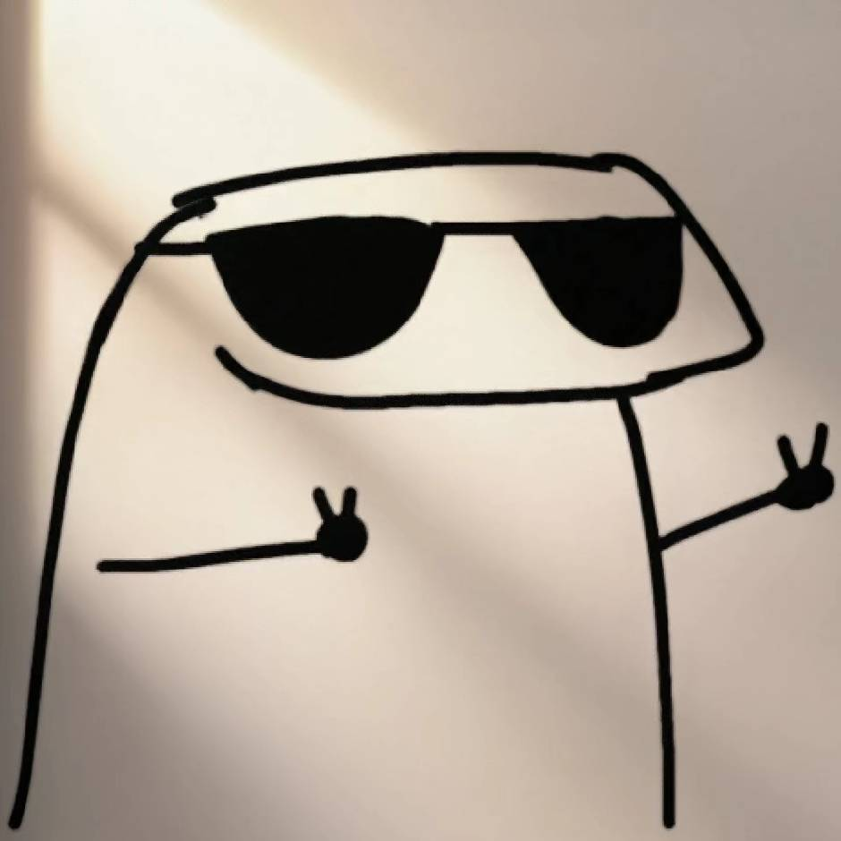

# 社员专栏
> 总部坐标： (23.0395 N, 113.3929 E) 🌟 

---

### 核心社员

<!-- 2 -->

  
  <h3 style="margin: 10px 0; color: #00f5d4; text-shadow: 0 0 8px rgba(0,245,212,0.8);">2</h3>
  
刺客

<!-- Leo -->

  
  <h3 style="margin: 10px 0; color: #ffb86c; text-shadow: 0 0 8px rgba(255,184,108,0.8);">Leo</h3>
  
旷野

<!-- Asahi -->

  
  <h3 style="margin: 10px 0; color: #ff79c6; text-shadow: 0 0 8px rgba(255,121,198,0.8);">Asahi</h3>
  
梦境

<!-- A -->

  
  <h3 style="margin: 10px 0; color: #ffd700; text-shadow: 0 0 8px rgba(255,215,0,0.8);">A</h3>
  
迷宫

<!-- YuxuAn -->

  
  <h3 style="margin: 10px 0; color: #8be9fd; text-shadow: 0 0 8px rgba(139,233,253,0.8);">YuxuAn</h3>
  
炼金术士

<!-- Adios -->

  
  <h3 style="margin: 10px 0; color: #ff5555; text-shadow: 0 0 8px rgba(255,85,85,0.8);">Adios</h3>
  
筑梦师

<!-- JKL -->

  
  <h3 style="margin: 10px 0; color: #bd93f9; text-shadow: 0 0 8px rgba(189,147,249,0.8);">JKL</h3>
  
重构者

<!-- azan -->

  
  <h3 style="margin: 10px 0; color: #50fa7b; text-shadow: 0 0 8px rgba(80,250,123,0.8);">azan</h3>
  
守护者

<!-- Moon_thoughts -->

  
  <h3 style="margin: 10px 0; color: #fca311; text-shadow: 0 0 8px rgba(252,163,17,0.8);">Moon_thoughts</h3>
  
起源

<!-- ๑卟卟〇° -->

  
  <h3 style="margin: 10px 0; color: #ff9ac1; text-shadow: 0 0 8px rgba(255,154,193,0.8);">๑卟卟〇°</h3>
  
执灯

<!-- AKA翡冷翠嘎子哥 -->

  
  <h3 style="margin: 10px 0; color: #f1fa8c; text-shadow: 0 0 8px rgba(241,250,140,0.8);">AKA翡冷翠嘎子哥</h3>
  
混沌

